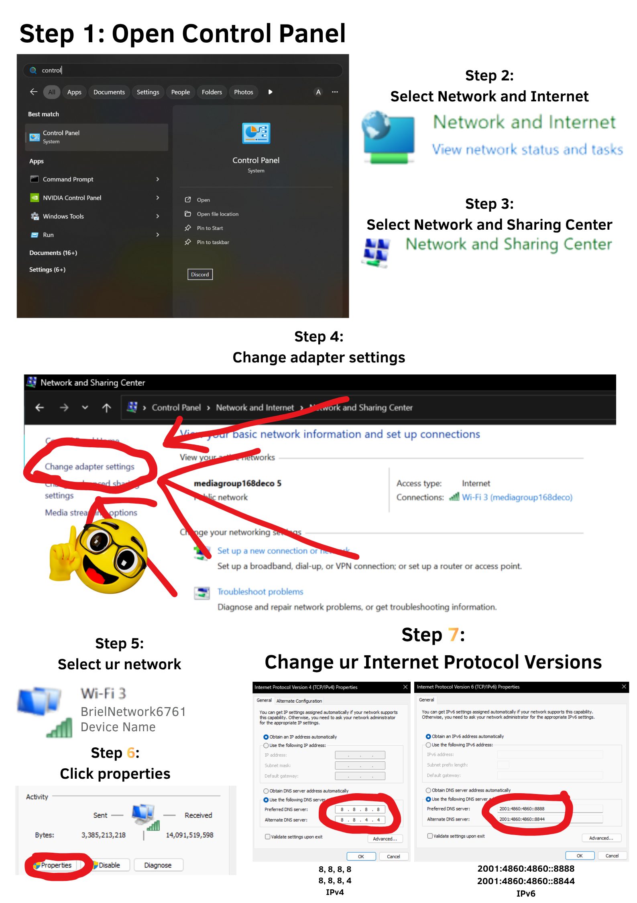

**Reset's Horror Smorgasbord** is a Minecraft Forge Modpack that turns the game into a cohesive horror experience.  
This repository provides guidance for the trickier parts of setup, such as enabling **LAN servers** and configuring **Simple Voice Chat**.

---

## ⚙️ How to Set Up a LAN Server

1. Start and load a **Singleplayer World**.  
2. Press **ESC** and select **OPEN TO LAN**.  
3. Change the **port** to `24454` (Default Simple Voice Chat Port).  
4. *(Optional)* Switch from **Online Mode** to **Offline Mode + UUID Fix** to allow cracked players.  
5. Start the server and wait for it to load.  
6. Copy the link that appears in chat and send it to your players!

---

## 🎙️ How to Add Simple Voice Chat to a LAN Server

### Step 1: Configure Network Settings
People who join the server **must also configure their IPv4 and IPv6 DNS settings** as shown below:

### Step 2–10: Set Up the Tunnel
1. Go to [https://playit.gg/](https://playit.gg/) and create an account.  
2. Download the **Playit app** to run tunnels.  
3. Create a new **UDP/TCP tunnel**.  
4. Change the **local port** of the tunnel to `24454`.  
5. On your computer, **start the tunnel**.  
6. Navigate to the modpack’s **mod config folder**.  
7. Open the **Simple Voice Chat server config file**.  
8. Set the `voicehost` to the tunnel’s **public address**.  
9. Save and **boot up the server**.

---

## 🧩 Additional Information

- **Low FPS or Frame Lag**  
  → The host should increase the allocated memory for the modpack from 4 GB to **8 GB** or even **12 GB**.

- **High Ping / Lag Issues**
  - **A.** *E4mc (Online LAN Mod)* may be having issues.  
    → Fix: Wait for updates or stability improvements.  
  - **B.** *Host’s Internet is weak.*  
    → Fix: Improve connection or switch hosts.  
  - **C.** *Playit.gg tunnel lagging.*  
    → Fix: Restart the tunnel.

---

### 🧠 Tips
- Always use the same port (`24454`) for voice chat consistency.  
- If your players can’t connect, verify both **IPv4** and **IPv6** are properly configured on their machines.  
- Restarting Playit tunnels often resolves connection issues quickly.
